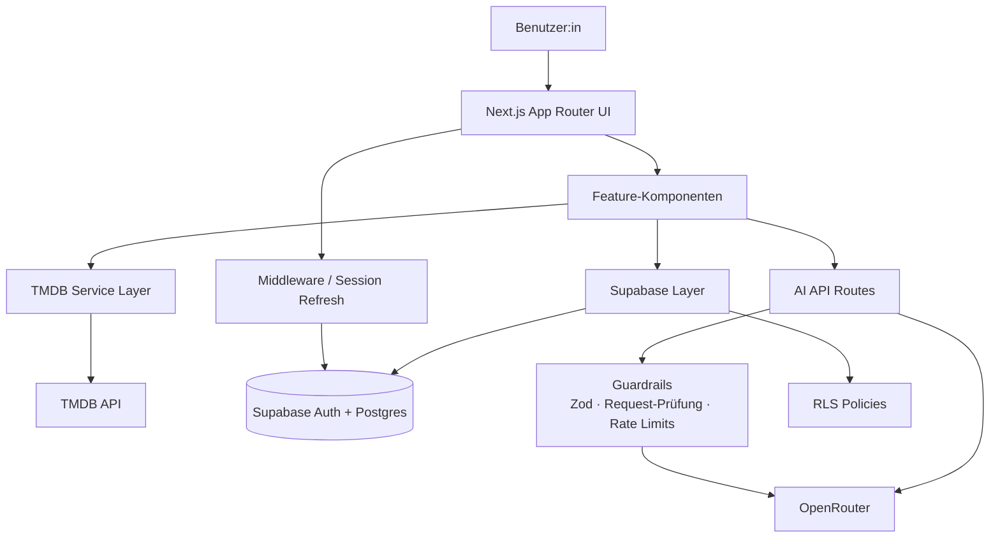

# CineScope

CineScope ist eine produktionsnahe Film- und Serien-Explorer-Web-App auf Basis von TMDB, Supabase und OpenRouter. Die Anwendung verbindet klassische Discovery-Features wie Suche, Trends, Popular-Listen und Detailseiten mit einer persistenten Watchlist, Authentifizierung, Jugendschutz-Logik, Streaming-Verfügbarkeit pro Land und einem integrierten KI-Layer für Empfehlungen, Einordnung und Auswahlhilfe.

Produktiver Link: `https://cine-scope-realr4an.vercel.app/`

Hinweis: Alle Pfadverweise in dieser README sind als relative Repository-Verweise formuliert und passen zum aktuellen Stand des `main`-Branches.

## Kurzbeschreibung und gewähltes Thema

Gewähltes Thema: `Film- & Serien-Explorer`

Ziel des Projekts:

- Filme und Serien suchen, entdecken und filtern
- Trends und populäre Titel sichtbar machen
- Detailseiten mit Cast, Trailer, Bewertungen, Sprachen, Streaming-Anbietern und ähnlichen Titeln bereitstellen
- Inhalte in einer Watchlist speichern und persönlich bewerten
- einen KI-Assistenten für Auswahlhilfe, Vergleiche und Einordnung anbieten

Diese README deckt die vier geforderten Punkte explizit ab:

1. Kurzbeschreibung des Projekts und des gewählten Themas
2. Anleitung zum lokalen Setup
3. Beschreibung der implementierten Features
4. Dokumentation des Agentic-Engineering-Ansatzes

## Implementierte Features

### Kernfunktionen

- Startseite mit `Trending Movies`, `Trending TV`, `Popular Movies` und `Popular TV`
- Suchseite mit Textsuche, Filtern und paginierten Ergebnissen
- genrebasierte Entdeckungsseite mit eigener Discover-Logik
- Detailseiten für Filme und Serien mit:
  - KI-generiertem Kurzüberblick
  - Cast
  - Trailer
  - Similar Titles
  - erweiterten Metadaten
  - verfügbaren Sprachen
  - Altersfreigabe
  - Streaming-Verfügbarkeit pro Land
- Personenseiten mit Filmografie und KI-Einordnung
- Sammlungsseiten für Startseiten-Bereiche wie Trends und Popular-Listen

### Nutzerkonto, Persistenz und Personalisierung

- Supabase Auth mit Login, Signup, Logout und Passwort-Reset
- persistente Watchlist pro Nutzer:in
- Watchlist-Feedback pro Titel:
  - `gesehen`
  - `gefällt mir`
  - `gefällt mir nicht`
- gespeicherte Präferenzen wie bevorzugte Streaming-Region
- Account-Einstellungen für persönliche Angaben und jugendschutzrelevante Daten
- Altersfilter für Gäste per Cookie und für eingeloggte Accounts zusätzlich über das Profil

### KI-Features

- KI-Assistent für freie Medienanfragen und Auswahlhilfe
- Titelvergleich
- geführte Auswahlhilfe auf Basis von Stimmung, Anlass und Follow-up-Fragen
- KI-Zusammenfassungen auf Detailseiten
- KI-Vibe-Tags und Content-Hinweise
- KI-gestützte Watchlist-Priorisierung und Gruppierung
- KI-klassifiziertes Feedback mit Blockierung nur klar böswilliger Einträge

### UX und Produktqualität

- responsives Layout für Desktop und Mobile
- Dark Mode
- Lade-, Fehler- und Leerzustände
- klickbare KI-Empfehlungen
- horizontale Content-Bereiche mit Maus- und Touch-Nutzung
- `Where to watch` mit Länderwahl
- rechtliche Seiten für Impressum und Datenschutz

## Architekturüberblick



Kernidee der Architektur:

- App Router für Seiten, Layouts und API-Routen
- Feature-Ordner für UI- und Produktlogik
- dedizierter TMDB-Service-Layer
- dedizierte Supabase-Utilities für Auth, Server-Clients und Queries
- dedizierte KI-Schicht mit Prompts, Schemas, Guardrails und serverseitiger OpenRouter-Anbindung
- Zod für Input-Validierung und strukturierte KI-Antworten

## Projektstruktur

```text
src/
  app/
    page.tsx
    search/page.tsx
    discover/page.tsx
    collections/[kind]/page.tsx
    movie/[id]/page.tsx
    tv/[id]/page.tsx
    person/[id]/page.tsx
    watchlist/page.tsx
    ai/page.tsx
    account/page.tsx
    feedback/page.tsx
    admin/feedback/page.tsx
    auth/*
    api/*
  components/
    layout/
    cards/
    sections/
    shared/
    states/
    ui/
  features/
    ai/
    ai-chat/
    auth/
    discover/
    feedback/
    i18n/
    search/
    watch-providers/
    watchlist/
  lib/
    age-gate/
    ai/
    env.ts
    format.ts
    i18n/
    security/
    supabase/
    tmdb/
    validators/
  types/
middleware.ts
supabase/schema.sql
```

## Verwendete Technologien

### Laufzeit, Framework und Sprache

| Bereich | Technologie | Version / Stand | Zweck |
| --- | --- | --- | --- |
| Framework | Next.js | `15.5.x` | Fullstack-Framework, App Router, SSR, API Routes |
| UI Runtime | React | `19.2.x` | Komponentenmodell |
| Sprache | TypeScript | `5.9.x` | strikte Typisierung |
| Styling | Tailwind CSS | `4.1.x` | Utility-first Styling |
| Motion | Framer Motion | `12.x` | Übergänge und Animationen |
| Icons | lucide-react | `0.453.x` | konsistente Icon-Sprache |
| Theme | next-themes | `0.4.x` | Light-/Dark-Mode |
| Form Handling | react-hook-form + zod | `7.x` / `4.x` | Formzustand und Validierung |
| Notifications | sonner | `2.x` | Toasts |

### Daten, Auth und Persistenz

| Bereich | Technologie | Zweck |
| --- | --- | --- |
| Auth | Supabase Auth | Login, Signup, Passwort-Reset, Session-Verwaltung |
| Datenbank | Supabase Postgres | Watchlist, Profile, Präferenzen, Feedback |
| SSR Auth | `@supabase/ssr` | Server- und Middleware-kompatibler Session-Zugriff |
| Security | Supabase RLS | nutzerbezogene Zugriffskontrolle auf Tabellenebene |

### Medien- und KI-Integration

| Bereich | Technologie | Zweck |
| --- | --- | --- |
| Medienkatalog | TMDB API | Suche, Trends, Popular, Details, Credits, Videos, Discover |
| Watch Availability | TMDB Watch Providers | Streaming-, Kauf- und Leih-Verfügbarkeit je Region |
| KI-Gateway | OpenRouter | serverseitige Anbindung an Sprachmodelle |
| Standardmodell | `openai/gpt-4o-mini` | Empfehlungen, Zusammenfassungen, Vergleich, Feedback-Klassifizierung |
| Modellkonfiguration | `OPENROUTER_MODEL` | austauschbares Modell per Environment Variable |

## Detailliertes KI-Setup

### Eingesetztes Modell

- Standardmäßig verwendet die App über OpenRouter das Modell `openai/gpt-4o-mini`.
- Das Modell ist nicht hart im Code fixiert, sondern über `OPENROUTER_MODEL` konfigurierbar.
- Fallback in der OpenRouter-Anbindung: `openai/gpt-4o-mini`, falls kein Modell explizit gesetzt ist.

### Wofür das Modell eingesetzt wird

- KI-Assistent auf der `/ai`-Seite
- strukturierte Vergleichs- und Empfehlungsantworten
- KI-Zusammenfassungen auf Detailseiten
- Vibe-Tags und Content-Hinweise
- Watchlist-Priorisierung
- Person-Insights
- Feedback-Klassifizierung als böswillig / unkritisch

### Wie die Modellnutzung technisch umgesetzt ist

- ausschließlich serverseitige OpenRouter-Nutzung
- zentrale Kapselung in [`src/lib/ai/openrouter.ts`](./src/lib/ai/openrouter.ts)
- strukturierte JSON-Antworten für deterministischere Features
- kontrollierte Temperatur je Use Case
- Retry mit konservativerer Temperatur, wenn ein JSON-Format nicht stabil geliefert wird
- serverseitige Guardrails gegen Prompt Injection und Datenexfiltration

## Sicherheits- und Härtungsmaßnahmen

### 1. Secret-Handling und Trennung von Client und Server

- Secrets werden ausschließlich über Environment Variables bezogen.
- `SUPABASE_SERVICE_ROLE_KEY`, `TMDB_API_KEY`, `TMDB_ACCESS_TOKEN` und `OPENROUTER_API_KEY` werden nicht im Client verwendet.
- Öffentlich exponiert werden nur `NEXT_PUBLIC_*`-Variablen.
- Umgebungsvariablen werden über Zod validiert in [`src/lib/env.ts`](./src/lib/env.ts).

### 2. Supabase Security und RLS

Die Datenbank nutzt Row Level Security für alle nutzerspezifischen Tabellen:

- `profiles`
- `watchlist_items`
- `user_preferences`
- `ai_chat_sessions`
- `ai_chat_messages`
- `feedback_entries`

Umgesetzt sind unter anderem:

- Watchlist nur für `auth.uid() = user_id`
- Profile nur für den eigenen Datensatz
- Präferenzen nur für den eigenen Datensatz
- Feedback-Lesen und -Löschen nur für Admins über `is_admin`

Schema: [`supabase/schema.sql`](./supabase/schema.sql)

### 3. Same-Origin-Schutz für schreibende Routen

Mutierende Routen prüfen die Request-Origin serverseitig, unter anderem:

- `/api/account/settings`
- `/api/ai/assistant`
- `/api/feedback`
- `/api/admin/feedback/[id]`
- Legacy Pages APIs für KI-Zusammenfassung und Empfehlungen

Die Request-Prüfung liegt in [`src/lib/security/request.ts`](./src/lib/security/request.ts).

### 4. Rate Limiting

Empfindliche Routen haben IP-basierte Rate Limits:

- Feedback-Submission
- Account-Settings
- KI-Assistent
- KI-Empfehlungen
- KI-Zusammenfassungen
- Admin-Feedback-Löschung

Technischer Stand:

- leichtgewichtiges In-Memory-Bucket-Limit in [`src/lib/security/rate-limit.ts`](./src/lib/security/rate-limit.ts)
- gut für lokale Entwicklung und Basisschutz
- für horizontale Skalierung wäre ein zentraler Store wie Redis oder Upstash der nächste saubere Schritt

### 5. Input-Validierung

- Request-Payloads werden mit Zod validiert.
- Environment Variables werden mit Zod validiert.
- KI-JSON-Antworten werden gegen Schemas geprüft, bevor sie in die UI gelangen.
- sicherheitsrelevante Felder wie Geburtsdatum, Feedback und KI-Inputs werden nicht ungeprüft verarbeitet.

### 6. Prompt-Injection-Schutz und KI-Guardrails

Die App enthält explizite Schutzlogik gegen missbräuchliche KI-Eingaben:

- Regex-basierte Erkennung starker und schwacher Prompt-Injection-Muster
- Blockade sensibler Daten-Exfiltration
- Sanitizing von Chat-Eingaben für den Assistenten
- Begrenzung von Längen und Formaten auf besonders kritischen Pfaden

Relevante Dateien:

- [`src/lib/security/prompt-injection.ts`](./src/lib/security/prompt-injection.ts)
- [`src/lib/ai/assistant-guard.ts`](./src/lib/ai/assistant-guard.ts)

### 7. Feedback-Härtung

- Feedback wird nicht blind gespeichert.
- Vor dem Persistieren wird es per KI darauf geprüft, ob es klar böswillig ist.
- Nur eindeutig missbräuchliche, beleidigende oder destruktive Einträge werden blockiert.
- Normales, kurzes, unperfektes oder hart formuliertes Produktfeedback wird weiterhin gespeichert.
- Gespeicherte Feedback-Einträge werden als `ai_checked`, `is_malicious`, `moderation_reason` und `ai_model` markiert.
- Feedback kann nur im Admin-Bereich vollständig eingesehen und gelöscht werden.

### 8. Auth- und Session-Härtung

- Supabase SSR wird im Server-Kontext und in der Middleware verwendet.
- Die Middleware aktualisiert Sessions serverseitig.
- Passwort-Reset läuft über Supabase und den Confirm-Step der App.
- geschützte Seiten wie Watchlist, Account oder Admin-Feedback leiten korrekt um.

Middleware: [`middleware.ts`](./middleware.ts)

### 9. Jugendschutz und Altersfilter

- Besucher:innen ohne Konto geben beim ersten Besuch ein Geburtsdatum an.
- Die Angabe wird in einem Cookie gespeichert.
- Bei eingeloggten Nutzer:innen wird das Geburtsdatum zusätzlich im Profil gespeichert.
- Listen- und Detailseiten filtern Inhalte anhand der Altersfreigabe.
- Für Filme wird bevorzugt die deutsche TMDB-Freigabe genutzt, mit Fallback auf US, wenn DE fehlt.
- Titel ohne belastbare Freigabe werden konservativ behandelt.

## Datenmodell

### `profiles`

- `id`
- `display_name`
- `avatar_url`
- `birth_date`
- `is_admin`
- `created_at`
- `updated_at`

### `watchlist_items`

- `id`
- `user_id`
- `tmdb_id`
- `media_type`
- `title`
- `poster_path`
- `backdrop_path`
- `release_date`
- `vote_average`
- `watched`
- `liked`
- `created_at`

### `user_preferences`

- `id`
- `user_id`
- `favorite_genres`
- `preferred_media_types`
- `preferred_region`
- `updated_at`

### `feedback_entries`

- `id`
- `user_id`
- `email`
- `display_name`
- `category`
- `message`
- `page_path`
- `moderation_summary`
- `moderation_reason`
- `ai_checked`
- `is_malicious`
- `ai_model`
- `created_at`

Hinweis:

- `is_constructive` existiert aktuell noch als Legacy-Spalte im Schema, wird für die aktive Moderationsentscheidung aber nicht mehr verwendet.
- `ai_chat_sessions` und `ai_chat_messages` sind im Schema vorbereitet; die aktuelle gespeicherte Chat-UI des Assistenten nutzt jedoch browserseitiges `localStorage`.

## Lokales Setup

### Voraussetzungen

- Node.js 20+
- npm 10+
- Supabase-Projekt
- TMDB API Key oder TMDB Access Token
- OpenRouter API Key

### Installation

1. Repository klonen
2. Abhängigkeiten installieren

```bash
npm install
```

3. `.env.local` anlegen

```bash
cp .env.example .env.local
```

4. `.env.local` mit den benötigten Werten füllen

Mindestens benötigt:

- `NEXT_PUBLIC_SUPABASE_URL`
- `NEXT_PUBLIC_SUPABASE_ANON_KEY`
- `SUPABASE_SERVICE_ROLE_KEY`
- `TMDB_API_KEY` oder `TMDB_ACCESS_TOKEN`
- `OPENROUTER_API_KEY`

5. Supabase-Schema ausführen

Die SQL-Datei liegt unter [`supabase/schema.sql`](./supabase/schema.sql). Den Inhalt im SQL-Editor des Supabase-Projekts ausführen, damit Tabellen, Trigger, Funktionen und RLS-Policies angelegt werden.

6. Entwicklungsserver starten

```bash
npm run dev
```

7. Typecheck und Build prüfen

```bash
npm run check
npm run build
```

8. Optional: Admin-Zugriff aktivieren

Falls der Admin-Feedback-Bereich genutzt werden soll, muss im Supabase-Profil für den gewünschten Account `is_admin = true` gesetzt sein.

Damit ist die lokale App vollständig lauffähig mit:

- Suche
- Discover
- Detailseiten
- Watchlist
- Account
- Feedback
- KI-Features

## Environment Variables

| Variable | Pflicht | Sichtbarkeit | Zweck |
| --- | --- | --- | --- |
| `NEXT_PUBLIC_SUPABASE_URL` | ja | public | Supabase Projekt-URL |
| `NEXT_PUBLIC_SUPABASE_ANON_KEY` | ja | public | öffentlicher Supabase Client-Key |
| `SUPABASE_SERVICE_ROLE_KEY` | ja | server-only | Admin-Zugriffe für serverseitige Operationen |
| `TMDB_API_KEY` | ja* | server-only | TMDB API Zugriff |
| `TMDB_ACCESS_TOKEN` | ja* | server-only | Alternative zu `TMDB_API_KEY` |
| `OPENROUTER_API_KEY` | ja | server-only | OpenRouter Zugriff |
| `OPENROUTER_MODEL` | nein | server-only | Modellwahl, standardmäßig `openai/gpt-4o-mini` |
| `NEXT_PUBLIC_APP_URL` | empfohlen | public | Basis-URL für Redirects und produktive Links |

\* Es reicht `TMDB_API_KEY` oder `TMDB_ACCESS_TOKEN`.

## TMDB-Integration

Abgedeckt sind:

- Trending Movies
- Trending TV
- Popular Movies
- Popular TV
- Search
- Movie Details
- TV Details
- Credits / Cast
- Videos / Trailer
- Similar Titles
- Discover by Genre
- Person Details und Combined Credits
- Watch Providers je Film und Serie
- Available Regions für den Country Selector

## Deployment

Zielplattform: Vercel

Aktueller produktiver Stand:

- Struktur auf Next.js + Vercel ausgelegt
- produktiver Link: `https://cine-scope-realr4an.vercel.app/`
- alle produktiven Environment Variables müssen im Vercel-Projekt gesetzt sein

## Agentic Engineering Dokumentation

Dieses Projekt wurde in einem bewusst mehrstufigen agentischen Workflow umgesetzt.

### Eingesetzter Workflow

1. Mit ChatGPT wurde zunächst ein Arbeitsplan für zwei spezialisierte AI-Agents erstellt.
2. Auf Basis dieses Plans wurde Manus für einen ersten Frontend-Stand eingesetzt.
3. Anschließend wurde ein darauf aufbauender Prompt für Codex formuliert, mit Fokus auf:
   - Fullstack-Integration
   - Service Layer
   - Auth und Persistenz
   - KI-Routen
   - Edge Cases
   - Deployment-Reife
4. Danach wurde iterativ mit Codex gearbeitet, inklusive laufendem menschlichem Feedback und Korrekturen.

Das Entscheidende daran: Die Agenten wurden nicht einfach nur nacheinander benutzt, sondern mit klar getrennten Rollen. Dadurch wurden visuelle Basis, Integrationslogik, Sicherheitsanforderungen und Feinschliff nicht vermischt.

### Rollen der Agenten

- ChatGPT:
  - Planung der Agentenaufteilung
  - Strukturierung der Arbeitsstrategie
  - Vorbereitung der Prompts
- Manus:
  - visuelle Grundlage
  - erste Layouts
  - erste Komponenten- und UX-Struktur
- Codex:
  - technische Integration in Next.js
  - Supabase-Anbindung
  - TMDB-Service-Layer
  - OpenRouter-Anbindung
  - Sicherheits- und Härtungsmaßnahmen
  - Fehlerbehebung
  - Deployment-Polish

### Was manuell entschieden und überprüft wurde

- welche UI-Teile aus dem ersten Frontend-Stand beibehalten werden und welche bewusst neu gebaut oder refaktoriert werden
- dass der Ziel-Stack konsequent auf Next.js App Router, TypeScript, Tailwind, Supabase, TMDB und OpenRouter ausgerichtet bleibt
- welche Features produktrelevant priorisiert werden und welche bewusst nicht weiter ausgebaut werden
- wie Services, Features, Presentational Components und Persistenz logisch getrennt werden
- wo strukturierte KI-Antworten robuster sind und wo dem Assistenten bewusst mehr Freiheit gegeben wird
- wie Guardrails gegen Prompt Injection, Datenexfiltration und Missbrauch gesetzt werden, ohne die Produktnutzung unnötig zu verschlechtern
- wie Nutzerfeedback, Altersfilter, Watchlist-Signale und persönliche Präferenzen sinnvoll zusammenspielen
- welche Fehlerbilder iterativ nachgeschärft wurden, zum Beispiel fehlerhafte Verlinkungen, unpassende KI-Treffer, fragile Follow-ups oder uneinheitliche UI-Texte

Diese Punkte sind wichtig, weil sie zeigen, dass KI hier nicht als unkontrollierter Generator eingesetzt wurde, sondern als Beschleuniger innerhalb eines bewusst gesteuerten Engineering-Prozesses.

### Eigener Steuerungsanteil

Die zentralen Entscheidungen dieses Projekts wurden nicht an Agenten delegiert, sondern aktiv gesteuert und bewertet. Dazu gehörten insbesondere:

- die Auswahl und Schärfung der Agentenprompts
- die Entscheidung, welche generierten Vorschläge übernommen, verworfen oder technisch neu umgesetzt werden
- die Definition der Sicherheitsgrenzen für API-Routen, KI-Nutzung und Datenzugriffe
- die Priorisierung von Qualität, Wartbarkeit und Erklärbarkeit vor maximaler Feature-Menge
- die laufende Korrektur von Produktdetails auf Basis echter Nutzung, Fehlverhalten und UX-Beobachtungen

Kurz gesagt: Die Agenten haben Struktur, Varianten und Implementierung beschleunigt. Die inhaltliche Verantwortung für Architektur, Produktlogik, Qualitätsniveau und Sicherheitsgrenzen lag aber durchgehend in manueller Steuerung.

## Trade-offs

- Das Rate Limiting ist aktuell bewusst einfach gehalten und nutzt In-Memory-Buckets statt eines zentralen externen Stores.
- Der KI-Layer ist bewusst serverseitig und guarded aufgebaut; das reduziert Risiko, macht strukturierte Flows aber kontrollierter als ein völlig freies Chatfenster.
- Gespeicherte Assistant-Chats liegen aktuell lokal im Browser und nicht serverseitig in Supabase.

## Nächste sinnvolle Ausbaustufen

- zentrales Rate Limiting mit Redis oder Upstash
- automatisierte Tests für Mapper, Zod-Schemas und Security-Helfer
- tiefere Observability für produktive Fehlerpfade
- serverseitige Persistenz für Assistant-Chats
- noch feinere Disambiguierung bei gleichnamigen Titeln im KI-Assistenten
- stärker personalisierte Home-Recommendations auf Basis von Watchlist-Signalen
